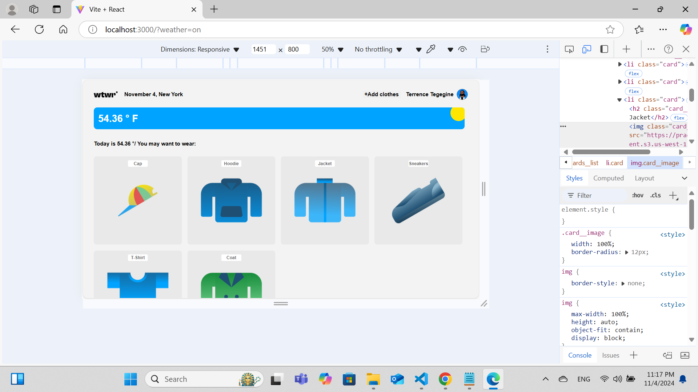

# Project 20: Se_project_react

## A description of the project and its functionality

This template provides a minimal setup to get React working in Vite with HMR and some ESLint rules.
Create and style components, and retrieve weather data using an API. The app displays clothing recommendations based on the current weather.

## Technologies and techniques used

- CSS: CSS (Cascading Style Sheets) allows you to create great-looking web pages.
- Javascript: A programming language that helps make web pages interactive.
- Vite : modern build tool designed to improve the development experience for web applications.
- API: An API defines the methods and data formats that users can use to exchange data.
- React: React is a JavaScript library that uses reusable UI components, making it convenient to build web applications.
- JSX : a syntax used in React that looks like HTML but works within JavaScript code.

## Screenshot

- This is a screenshot. 

## Frontend

- frontend on GitHub Page [here](https://github.com/sun4205/se_project_react.git)

## Backend

- backend on GitHub page [here](https://github.com/sun4205/se_project_express.git).
